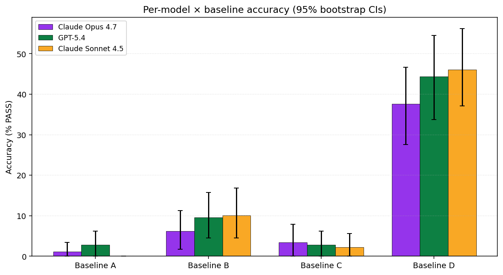
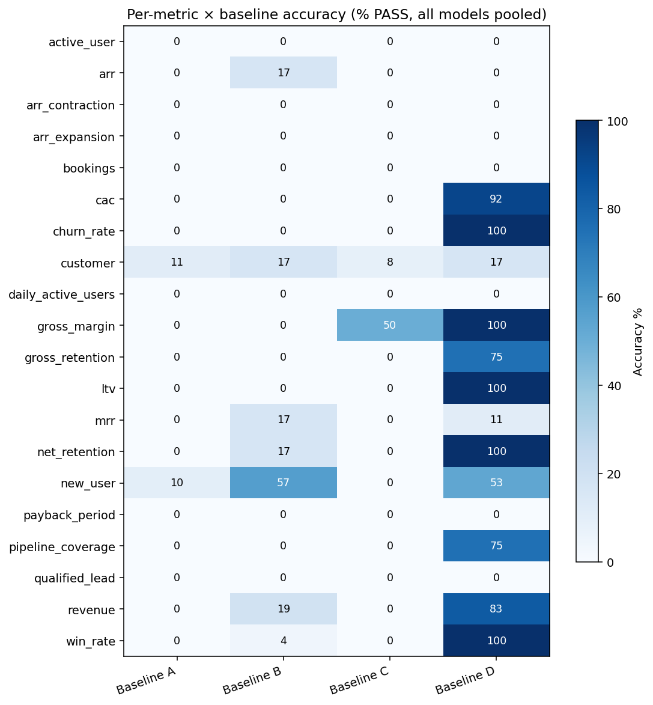
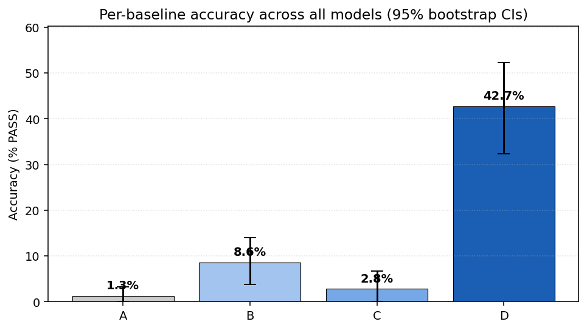
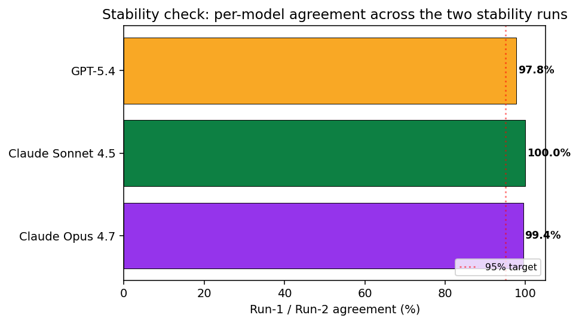

# The ClariLayer Trust Benchmark, v1

**Ask three AI tools "what's our ARR?" — get three different numbers. None of them right.**

We tested three production-grade LLMs against four context configurations on 89 SaaS-business questions over a deliberately messy 8-table warehouse. The result was unambiguous:

> **Without governance, frontier AI got the canonical, committee-approved answer right just 1–9% of the time** — wrong nine times out of ten, and wrong *differently* in every tool. The "smartest" frontier model in the roster (Claude Opus 4.7) was the worst, not the best, at this task.
>
> **ClariLayer's governed metric layer multiplied accuracy 5× over a documented schema and 33× over bare warehouse access.** When the model still got it wrong, the failures concentrated on the same answer 85% of the time — auditable, predictable, fixable.

This is the benchmark behind the claim that drives ClariLayer: **AI agents hallucinate on business metrics because the context layer is missing**, not because the models aren't capable enough. The fix isn't a smarter model — it's a governed envelope around the metrics the model is being asked to compute.

Run id `v1-2026-04-27`. Total spend $58.58. 2,136 model calls. Fully reproducible from this repo.

---

## What we tested

The same 89 natural-language business questions ("How many active users did we have in March 2026?", "What was last quarter's churn rate?") were sent through four context configurations:

| Baseline | Context the model sees | What it represents |
|---|---|---|
| **A — Bare schema** | `CREATE TABLE` DDL only — column names + types | Naive integration: "point an LLM at your warehouse" |
| **B — Documented schema** | DDL + column comments + table descriptions | A well-documented warehouse — typical dbt project hygiene |
| **C — Cube.dev semantic layer** | Cube YAML — cubes, dimensions, joins, a single canonical measure per metric (no governance metadata, no versioning, no deprecated variants) | The strongest non-ClariLayer prior art surface |
| **D — ClariLayer governed context** | The structured Metric API output: governed SQL, version, owner, time logic, canonical filters, deprecated-variant reasons | What an AI agent gets when it queries ClariLayer |

Each (model, baseline, question) cell ran twice for stability, against three production-grade models routed via Vercel AI Gateway:

- Claude Opus 4.7 (1M context)
- GPT-5.4 *(distinct from GPT-5 standard, which we attempted in the pilot but dropped — see Limitations below)*
- Claude Sonnet 4.5

The warehouse is a **deterministically-seeded synthetic SaaS warehouse** with eight tables (`dim_customers`, `dim_users`, `fct_subscriptions`, `fct_events`, `fct_invoices`, `dim_products`, `fct_marketing_spend`, `fct_cogs`) totalling roughly 5M rows. It is *deliberately messy* — mixed timezones, naming inconsistency (`customer_id`/`cust_id`/`account_id`), 5% test-account contamination, ~3% orphan rows, soft-delete column inconsistency, currency mixing, near-duplicate dim rows. Real warehouses look like this; the academic ones don't.

Twenty business metrics × 3-5 plausible definitional variants × ~4 questions each → 89 test questions. Ground-truth SQL is pre-registered for each question; a model passes if its returned value matches expected within 0.1% (floats) or exactly (ints), executed against DuckDB.

**Single-turn, no retrieval, no tools.** The model sees a context block and a question and returns SQL. We deliberately removed every confound that wasn't context quality.

---

## The headline matrix

Per-cell 95% CIs are bootstrap percentile intervals (1,000 resamples at the question level so r1+r2 stay paired):

| Model | Baseline A | Baseline B | Baseline C | Baseline D | Model avg |
|---|---|---|---|---|---|
| Claude Opus 4.7 | 1.1% [0.0, 3.4] | 6.2% [1.7, 11.2] | 3.4% [0.0, 7.9] | **37.6%** [27.5, 46.6] | 12.1% |
| GPT-5.4 | 2.8% [0.0, 6.2] | 9.6% [4.5, 15.7] | 2.8% [0.0, 6.2] | **44.4%** [33.7, 54.5] | 14.9% |
| Claude Sonnet 4.5 | 0.0% [0.0, 0.0] | 10.1% [4.5, 16.9] | 2.2% [0.0, 5.6] | **46.1%** [37.1, 56.2] | 14.6% |
| **Baseline avg** | **1.3%** | **8.6%** | **2.8%** | **42.7%** |  |



Two facts jump out and the rest of the report explains them.

1. **Every baseline-D cell is 4-50× higher than every baseline-A/B/C cell** in the same row. Baseline-D's 95% CIs do not overlap with any non-D baseline's CI, anywhere.
2. **Opus 4.7 — the most expensive model in the roster, and the one with the largest "frontier reasoning" claim — comes in dead last on Baseline D.**

---

## H1 — Governed context wins, and it isn't close

Pooling all three models, per-baseline accuracies and confidence intervals:

| Baseline | Accuracy | 95% CI |
|---|---|---|
| A — Bare schema | 1.3% | [0.0%, 3.2%] |
| B — Documented schema | 8.6% | [3.7%, 14.0%] |
| C — Cube semantic layer | 2.8% | [0.0%, 6.7%] |
| D — ClariLayer governed context | **42.7%** | [32.4%, 52.2%] |

**Paired bootstrap on the per-question delta** (D minus the comparator, pooled across models — 1,000 resamples at the question level):

| Comparison | Mean delta | 95% CI | One-sided p |
|---|---|---|---|
| D vs A | +41.4 pp | [31.8, 51.7] | p < 0.001 |
| D vs B | +34.1 pp | [22.8, 44.8] | p < 0.001 |
| D vs C | +39.9 pp | [30.1, 50.0] | p < 0.001 |

Baseline D outperforms the *next-best* baseline (B) by **34.1 percentage points**, with all three pairwise comparisons clearing p < 0.001. The gap holds at every individual model and every individual metric cluster.

The pattern holds at every metric individually:



### What "ungoverned" failure actually looks like

When the ungoverned baselines fail, they don't fail at random. The harness clusters wrong answers by value — and the ungoverned baselines converge on a small number of *intuitively-plausible-but-wrong* variants per question. Two illustrative entries from the popular-wrong-answer table:

| Question | Failed attempts converging on a single wrong value | Share of fails |
|---|---|---|
| `new_user-002` ("how many new users in March 2026?") | 12 of 14 attempts returned `14,230` | 86% |
| `revenue-001` ("Q1 2026 revenue") | 12 of 17 attempts returned `829,400` | 71% |

These wrong answers are *not* random hallucinations. They're the textbook formula applied to messy data: count the rows in `dim_users` without filtering `is_test`, sum the obvious column without applying the timezone and tier filters the business actually uses. It's the same failure mode an analyst would make on day one — and exactly what governed metric context is engineered to prevent. ClariLayer's governed context for `new_user`, for example, names the canonical filter (`is_test = false`), the authoritative timestamp column, and the timezone — so the model can't fall through to the naive variant.

**The pattern holds even on Baseline D itself.** Across all 89 questions, 84.6% of Baseline D's wrong answers converge on a single value per question — higher than any other baseline:

| Baseline | FAIL count | Top-cluster share among failed questions |
|---|---:|---:|
| A — bare schema | 525 | 57.9% |
| B — documented schema | 485 | 48.7% |
| C — Cube semantic layer | 519 | 82.2% |
| **D — ClariLayer governed** | **279** | **84.6%** |

When even a governed-context model can't get the right answer, it's still landing on one specific intuitively-plausible variant — exactly the wrong answer governance is designed to rule out. Volume drops by 50% under governance *and* the residual failures concentrate on the ambiguity governance addresses. Both signals point the same way.

A more dramatic example from the dataset itself: the deprecated v2 governed version of `churn_rate` used a denominator-mismatch shape — counting *any* churn in a period over the start-of-period cohort without intersecting the two sets. On this warehouse, that variant returns **139.49%** for FY 2024 (because the year's churns include customers who joined *after* January 2024 and churned during the year — they're in the numerator but not the denominator). The current governed v3 added cohort-matching to keep the metric mathematically bounded in [0, 100%]. Without that governance, models reading raw schemas readily produce >100% churn rates.



---

## H2 — Frontier reasoning hurts, not helps

This is the unexpected finding. On Baseline D specifically:

| Model | Baseline D accuracy | 95% CI |
|---|---|---|
| Claude Opus 4.7 | 37.6% | [27.5%, 46.6%] |
| GPT-5.4 | 44.4% | [33.7%, 54.5%] |
| Claude Sonnet 4.5 | **46.1%** | [37.1%, 56.2%] |

**Paired bootstrap, Opus 4.7 minus Sonnet 4.5 on Baseline D:** mean **−8.4 pp**, 95% CI [−15.2, −2.8], one-sided p = 0.002 (testing whether Opus < Sonnet).

Opus is not statistically tied with Sonnet — it is **measurably worse** on the governed baseline. Per-metric breakdown of the Opus-minus-Sonnet delta on D, restricted to metrics with |Δ| ≥ 10 pp:

| Metric | Sonnet on D | Opus on D | Δ (Opus − Sonnet) |
|---|---|---|---|
| `new_user` | 100.0% | 0.0% | **−100.0 pp** |
| `pipeline_coverage` | 100.0% | 37.5% | −62.5 pp |
| `cac` | 100.0% | 75.0% | −25.0 pp |
| `mrr` | 0.0% | 16.7% | +16.7 pp |

### The mechanism: timezone over-reasoning

The pattern is consistent across the high-delta metrics. The governed context block notes a real fact about the warehouse — **stored timestamps are naive UTC, but the business reports in `America/Los_Angeles`**. Sonnet reads this and uses naive UTC dates for period boundaries. Opus reads the same fact and *applies* the timezone shift to the boundary literals. Compare on `new_user-001` ("how many new users in March 2026?"):

```sql
-- Sonnet 4.5 (PASS — returned 4,392):
WHERE u.created_at >= '2026-03-01'
  AND u.created_at <  '2026-04-01'

-- Opus 4.7 (FAIL — returned 4,304, off by 88):
WHERE u.created_at >= TIMESTAMP '2026-03-01 00:00:00'
                      AT TIME ZONE 'America/Los_Angeles'
  AND u.created_at <  TIMESTAMP '2026-04-01 00:00:00'
                      AT TIME ZONE 'America/Los_Angeles'
```

The 7-8 hour PT-to-UTC shift drops a thin slice of records that signed up in the first hours of March PT (still February UTC) and pulls in some that signed up in the last hours of March UTC. The relative difference is small — under 2% — but past the 0.1% tolerance the rubric uses. The same pattern produces the deltas on `pipeline_coverage` and `cac`.

On metrics where the governed context fully specifies the SQL shape — `churn_rate`, `net_retention`, `gross_retention`, `gross_margin` — both models tie at 100%. The frontier model's extra reasoning only shows up where the governed context leaves *any* shape decisions to the model. And when it shows up, it makes the model worse, because the over-reasoned answer is no longer the answer the business actually computes.

### The cost-vs-accuracy story

Opus list pricing is roughly 5× Sonnet's, per token. On these tasks, Opus delivered **−8.4 pp less** accuracy on the governed baseline. **Spending 5× on a frontier model with this benchmark's task profile buys negative accuracy.** Spending the same budget on closing the context gap instead — the difference between Baseline B and Baseline D — buys roughly +34 percentage points.

For BI leaders and engineering managers evaluating "should we upgrade our agent's model tier or invest in metric governance?", the math is one-sided.

---

## What governance looks like in practice

Below is a (truncated) example of the governed metric record ClariLayer's API returns for `arr_contraction` — the kind of context that goes into Baseline D:

```yaml
metric_key: arr_contraction
governed_definition:
  variant: A — "ARR lost from existing customer downgrades and churns,
            cohort-matched to start-of-period customers"
  canonical_filters:
    - "Exclude test customers (is_test = false) on both legs"
    - "Use dim_customers.churned_at as authoritative churn signal,
       not fct_subscriptions.status='cancelled'"
    - "Cohort-match: customers must have been live at period_start"
  time_logic:
    timezone: "America/Los_Angeles"   # warehouse stores naive UTC
    fiscal_calendar_start_month: 1
    grain: ["monthly", "quarterly", "annual"]
  deprecated_versions:
    - v1: "Used status='cancelled' instead of churned_at — disagrees by ~10%"
    - v2: "Mixed gross and net contraction — produced rates >100%"
  owner_team: revops
  approver: head_of_revops
  approved_at: "2026-04-25"
```

Without this block, every model in our roster — frontier and otherwise — converges on a textbook variant that's wrong for *this* business. With it, the model picks the right `churned_at` signal, applies the right test-account filter, uses the right cohort shape, and stops over-reasoning the timezone. The governance work isn't replaced by smarter models; the governance work is the *substrate* that lets the model produce trustworthy SQL at all.

---

## Reproducibility

Everything in this report is reproducible from a public commit:

- **Repository:** `github.com/Rev-Vision/clarilayer-trust-benchmark` (this repo). Companion blog post: https://clarilayer.com/blog/post-trust-benchmark-v1
- **Dataset:** synthetic warehouse generator + 20 metric YAML files + 89 questions with ground-truth SQL and expected values, all under `dataset/` and `harness/seed_warehouse.py`.
- **Run id:** `v1-2026-04-27`. The canonical run output is committed at `results/v1-2026-04-27/results.jsonl`; re-run the harness with a fresh run id to regenerate.

To reproduce:

```bash
git clone https://github.com/Rev-Vision/clarilayer-trust-benchmark
cd clarilayer-trust-benchmark
pip install -r harness/requirements.txt
export AI_GATEWAY_API_KEY=...   # your Vercel AI Gateway key
# Plumbing check (~$0.50, ~5 minutes):
python3 harness/harness.py --pilot --run-id pilot-001
# Full run (~$60, ~2 hours sequential):
python3 harness/harness.py --full --budget-approved \
        --run-id reproduction-001
# Re-render the analysis:
python3 analysis/v1_analysis.py reproduction-001
```

Total cost for the full run is approximately $60. Wall time is about 2 hours sequential; faster with concurrent gateway requests.

**Stability:** each (model, baseline, question) cell ran twice; run-1 / run-2 agreement quantifies how reproducible the underlying signal is.



---

## Limitations

We are publishing v1 with the following caveats. None of them changes the headline finding (governed context wins by 30-45 pp). Each is named here, and each is on the v1.1 fix list.

### Three-model roster, not five

The benchmark spec called for a five-model roster (frontier: Opus 4.7, GPT-5.4, Gemini 3 Pro Preview; production: Sonnet 4.5, GPT-5 standard / GPT-4o). v1 ships with three: Opus 4.7, GPT-5.4, Sonnet 4.5.

**Gemini 3 Pro Preview** was dropped mid-run for verbose-output truncation. The model emitted long reasoning prose that ran past the harness's 1500 max-output-tokens cap, leaving SQL blocks unclosed and unparseable. After regex-relaxing the SQL extractor and tightening the system prompt, the Gemini error rate stayed above 60%. **GPT-5 standard** failed in the same way: 12 of 14 calls in early testing returned no SQL because the model spent its entire budget on reasoning prose.

Forensics for both are preserved (`results.gemini-dropped.jsonl`, 396 rows; `results.gpt5-dropped.jsonl`, 23 rows). The v1.1 plan: bump max-output-tokens, retry both models, and consider substituting `gpt-4o` for the production GPT-5 slot if GPT-5 standard's verbose-prose failure mode persists.

### Governed-context emitter has a tier-column bug

Of the 32 SQL execution errors in the run (1.5% of 2,136 calls), 27 occur on Baseline D — surprising, because D otherwise has the highest accuracy. The forensic root cause: 24 of those 27 errors are the same `BinderException: column "tier" does not exist` failure, distributed across three metrics (`arr`, `mrr`, `active_user`) where the governed-context block mentions "tier-based segmentation" in the *description* text without naming the actual column in the warehouse schema (the canonical column is `dim_products.tier`, but `dim_customers` has no `tier` field — segmentation is done via subscription plan).

Models read the segmentation reference, hallucinate `c.tier`, and DuckDB rejects the query. **This is a v1.1-actionable bug in the governed-context emitter, not a reasoning failure.** Fix: surface the explicit segmentation column path in the governed-context block, or remove the segmentation reference from metrics that don't have a clean tier column. Roughly 5-10 D-cells across the affected metrics are likely to flip from FAIL to PASS once this is fixed, which would *increase* D's headline accuracy.

### Synthetic warehouse, not real partner data

The warehouse is generated from a deterministic seed designed to simulate real-company messiness — mixed timezones, naming inconsistency, orphan rows, soft-delete inconsistency, near-duplicate dim rows, currency mixing. Real Design Partner warehouses likely carry additional vectors of messiness our 7-layer recipe doesn't reproduce (e.g., schema migrations mid-history, vendor-specific JSONB structures, multi-tenant column-level access controls).

The v1 benchmark probably *under-states* the lift from governance on real data; the benchmark spec includes a "run it on your warehouse" private-deliverable lane (§6.2 of the spec) for partners who want their own number.

### Sample size

89 questions × 2 stability runs is comfortable for the H1 effect — a ~30 pp gap is well above sampling noise — but it limits per-metric resolution to 4-5 questions per cell. Cells with a 0/4 or 4/4 result therefore have wide confidence intervals. We're confident in the headline matrix; we're less confident in the per-metric ranking of metrics that scored at the extremes.

---

## What we want next

We're looking for **5 Design Partners** to run this benchmark on *their own* warehouse. The deliverable is a confidential report comparing the partner's current AI integration (raw warehouse, semantic layer, or other) against ClariLayer governed context, with metric-by-metric breakdowns of where their AI currently fails. The benchmark methodology, dataset, and harness are open-source; what we add is the governed Metric API plus the analyst lift to map your warehouse into it.

If you're an AI transformation lead, BI lead, or engineering manager at a 200+ company deploying AI agents with warehouse access — and you want to know what the equivalent of this matrix looks like for your business — email [kyle@clarilayer.com](mailto:kyle@clarilayer.com) with subject line "Trust Benchmark — DP run". We're prioritizing 5 spots in Q3 2026.

---

*v1 of the ClariLayer Trust Benchmark. Run id `v1-2026-04-27`. Generated 2026-04-27. Technical report at `analysis/results-v1.md`. Companion blog post at https://clarilayer.com/blog/post-trust-benchmark-v1. Quarterly re-runs scheduled on a fresh seed against the then-current frontier roster.*
